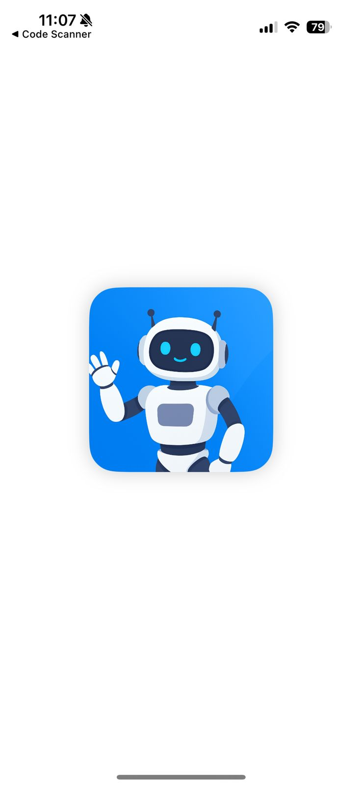
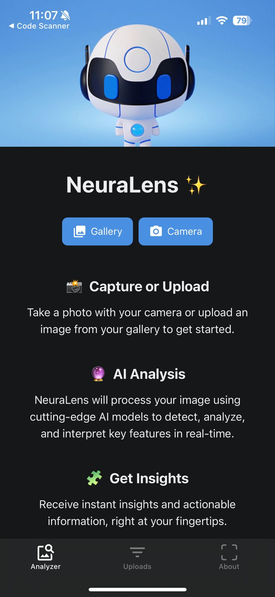
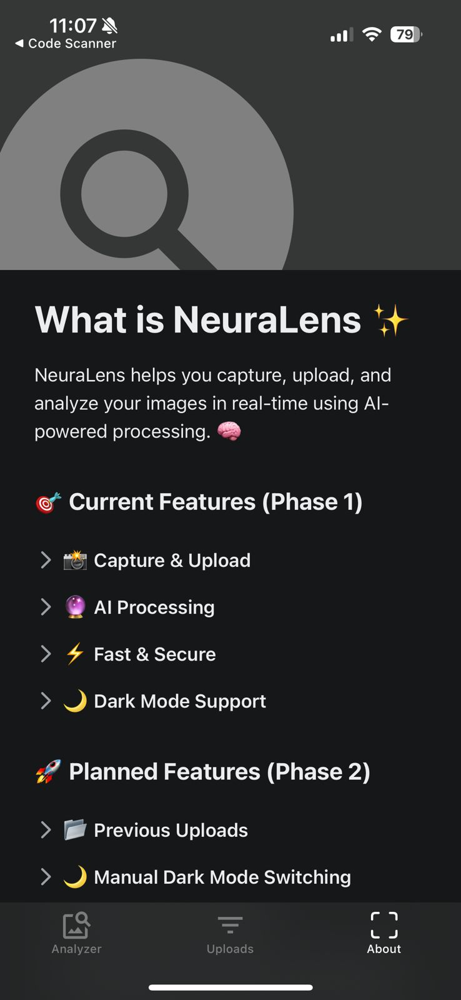
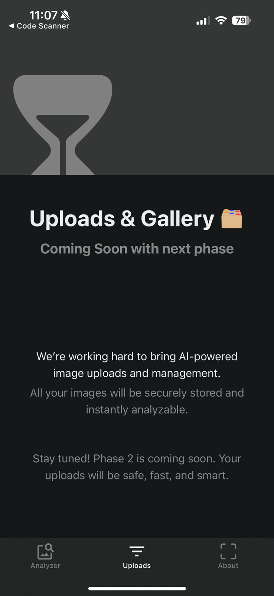
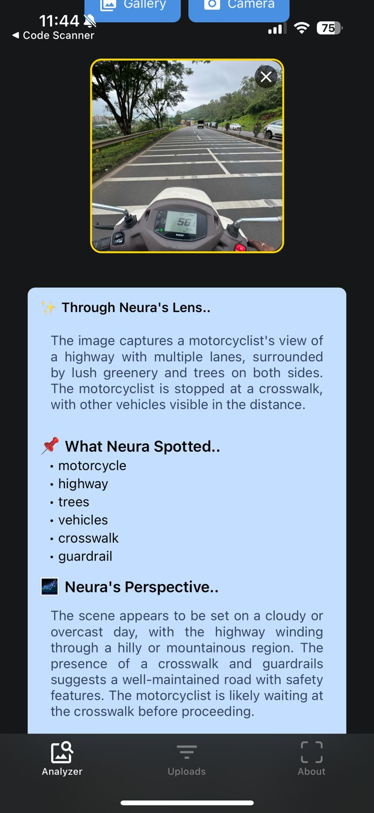
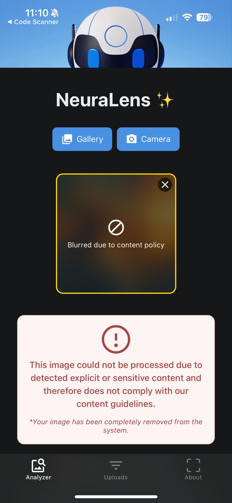
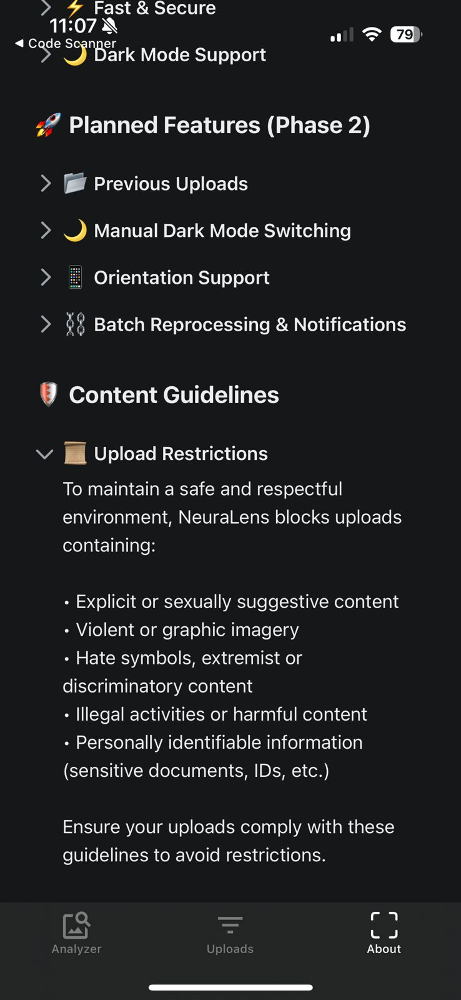

# NeuraLens (Native App) 📸🧠

**NeuraLens** is a **cross-platform mobile app** built with **React Native + Expo**, designed to intelligently **detect, analyze, and interpret images** using **AI**. Unlike conventional object detection, NeuraLens provides **semantic understanding of images**, offering deeper insights about the scene, key objects, context, and mood. The app is built with a **modular, scalable architecture**, making it ready for future enhancements and AI integrations.

## 🚀 Features
- 📸 **Capture & Upload:** Take photos or select from gallery seamlessly.
- 🔮 **AI-Powered Analysis:** Get descriptive insights about images, including objects, context, and mood.
- 🌍 **Cross-Platform:** Works on iOS, Android, and Web without extra configuration.
- 📦 **Modular & Scalable:** Easy to extend and maintain as the app grows.
- 🔐 **Secure & Reliable:** Future plans for authentication, pipeline handling, and safe content filtering.

## 🏗 Tech Stack
- [**React Native + Expo**](https://docs.expo.dev/) – Cross-platform app framework  
- [**LLaMA 4 Maverick (Free API)**](https://ai.meta.com/llama/) – AI for image understanding  
- [**AWS S3 + CloudFront**](https://aws.amazon.com/s3/) – Cloud storage & CDN for images  
- [**React Navigation**](https://reactnavigation.org/) – App routing & navigation  
- [**Redux**](https://redux.js.org/) / [**Zustand**](https://zustand-demo.pmnd.rs/) (Optional) – State management  

## 🔮 AI Analysis

NeuraLens leverages **LLaMA 4 Maverick** via a backend proxy to generate structured insights about uploaded images. The analysis includes:

- Overview of the scene (2-3 lines)
- Key objects/entities detected
- Contextual information such as surroundings, mood, and colors

#### Think of it like:
- **YOLO (eyes) 👀 =** instantly spots and labels objects  
- **LLaMA (brain) 🧠 =** explains what those objects *mean*

The app is designed with **scalability and modular architecture** in mind, supporting:

- Real-time image analysis powered by **LLaMA 4 Maverick**  
- Multi-platform deployment (**iOS, Android, Web**) with **Expo**  
- Cloud storage for uploaded images (**AWS S3 + CloudFront CDN**)  
- Future-ready AI and backend integrations for advanced image processing

## 📱 Screens

| | | |
|---|---|---|
|  |  |  |
|  |  |  |
|  |  |  |

## ⚡ Getting Started

### 1. Clone the repo
```bash
git clone https://github.com/shivamv12/neura-lens.git
cd neura-lens
```
### 2. Install dependencies
```bash
npm install
```

or if you using yarn, you can run

```bash
yarn install
```

### 3. Run the App
Start the Expo development server with cache reset:  
```bash
npx expo start -c
```
Or, to run using a tunnel (useful for testing on a device over the internet):
```bash
npx expo start --tunnel -c
```
### 3. Run the app
```bash
npx expo start -c
```
or for tunnel running, you can execute below command,
```bash
npx expo start --tunnel -c
```
After the application boots:
- **iOS / Android:** Scan the QR code in Expo Go to run the app on your device.
- **Web:** Press `w` in the terminal to open the app in your browser.
- **Android Emulator:** Press `a` in the terminal to launch the app in an emulator.

## 🎯 Conclusion & Future Roadmap (Phase 2)

NeuraLens is a **scalable, cross-platform image analysis app** built with React Native + Expo, leveraging **LLaMA 4 Maverick** for intelligent insights.

### 🔐 Authentication & User History
Add auth system so users can log in and view their previous uploads (history of processed images).

### 🔄 Processing Pipeline & Notifications
Implement a processing pipeline (Or may be with Batch APIs) where failed images can be retried or logged, and optionally push notifications later once failed pictures processed.

### 🚫 Content Safety & Moderation
Integrate a filter (using LLaMA or a lightweight classifier) to prevent generating responses for objectionable / unsafe images.

### 🧠 Custom Model Training (Experimental)
Hypothetical Future goal: Collect datasets of input images + labels to fine-tune a model on NeuraLens-specific use cases. Currently hypothetical, but sets the stage for domain-specific intelligence.

## 🤝 Contributing

Contributions, issues, and feature requests are welcome!
Feel free to open a PR or create an issue.

<!-- ## 📜 License

This project is licensed under the MIT License – see the LICENSE
 file for details. -->

## 🙏 Acknowledgments

- React Native & Expo – For providing the cross-platform framework and development ecosystem.  
- LLaMA 4 Maverick – For powering the AI-driven image analysis.  
- AWS S3 & CloudFront – For scalable storage and fast content delivery.  
- OpenRouter – For proxying API requests to LLaMA.  
- The open-source community – For libraries, tutorials, and guidance that made this project possible.  
- Inspiration from **YOLO** object detection concepts and other AI image analysis research.
